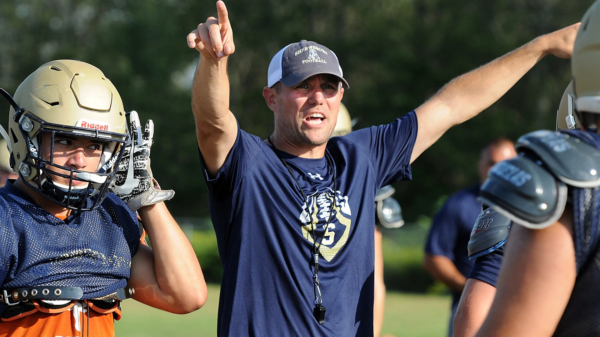

# Chess Coach

 

#### My attempt at a simple chess platform, to help explore openings and endgames.

  

 

## Briefing

Coach comes fully equipped with:
- [x]  Basic UI settings
- [x]  Import/export functionality
- [x]  Board annotations
- [x]  ECO interpreter
- [ ]  Syzygy interpreter
- [x]  Stockfish bot with variable skill
- [ ]  Coach's own bot!
- [ ]  Drills for openings
- [ ]  Drills for endgames
- [ ]  Drills for chess vision

The GUI is *unspeakably* simple. Give it a whirl.

### Dependencies

**Libraries**&nbsp;&nbsp;&nbsp;&nbsp;&nbsp; Specified in `dependencies.txt`, surpringly.

**Internet**&nbsp;&nbsp;&nbsp;&nbsp;&nbsp;&nbsp;&nbsp;Just _one_ of coach's many talents requires a live internet connection (the Stockfish bot), only once, on the first run. Anywhichway, it's optional.

### ECO Interpreter

My openings database is based on the [Encyclopedia of Chess Openings](https://www.365chess.com/eco.php).
So that coach works offline, I cleaned & converted this ECO catalogue to CSV format. ETL details soon.

### Coachbot

[WIP]

### License

[Unlincensed](LICENSE).

---

[Back Up Top](#chess-coach)
