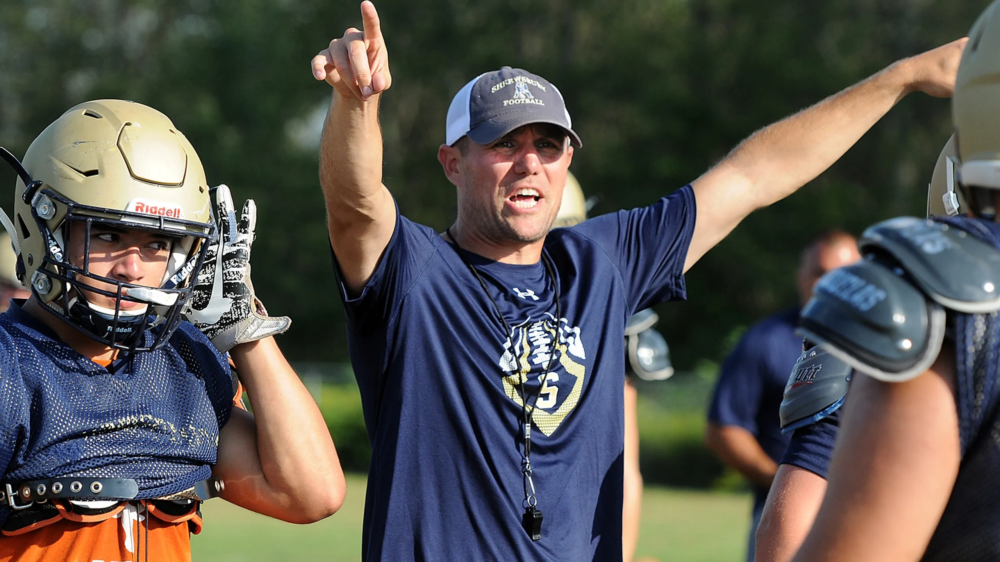

# Chess Coach

#### My attempt at a simple chess platform, intended to help explore openings.

 

## Briefing

I built everything from the ground up, using minimal dependencies and even creating many of the icons myself.

The GUI is *unbelievably* simple to use. Not much else to say here, just give it a whirl.

#### Dependencies

Fully specified in the `.txt` file, run these CLI commands first:

- `pip install pygame`
- `pip install chess`

 

## License

Everything here is [unlincensed](LICENSE).

---

[Back Up Top](#project-name)
